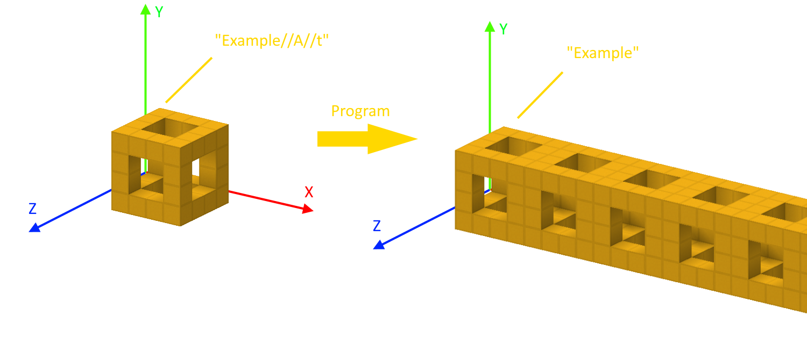
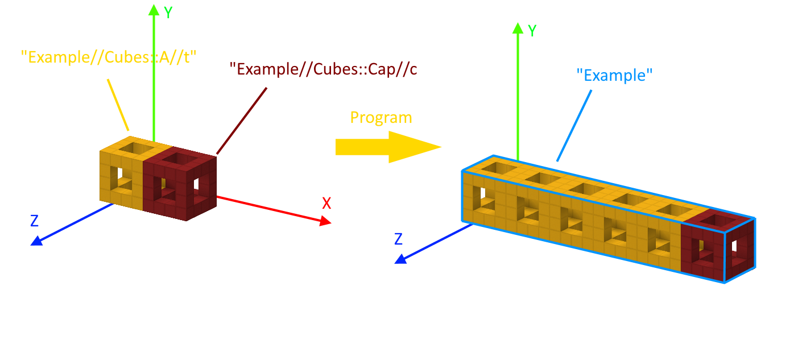
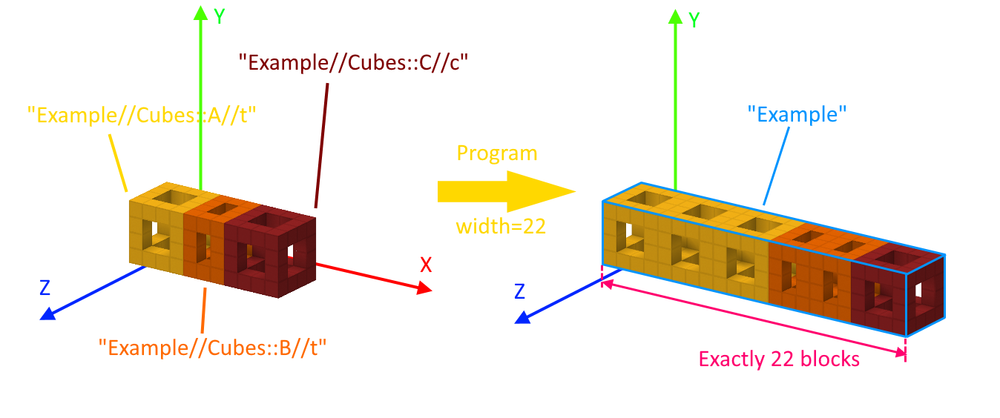
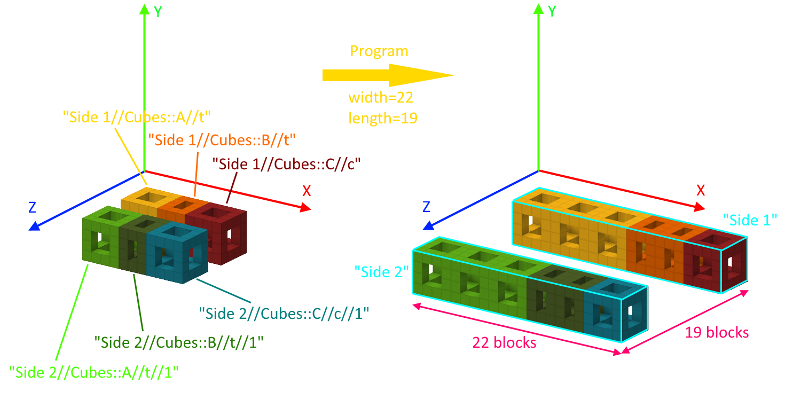

# Schematic-Tiling
A program for making schematics of large minecraft builds consisting of many repeating parts, such as world eaters, tunnel bores, floor placers, etc.
# Installation
The easiest way is to download an executable file from [releases](https://github.com/EQUENOS-2/Schematic-Tiling/releases).

If you have [Python](https://www.python.org/downloads/), you can install the `litemapy` library by running `pip install litemapy` in the console. After that you'll be able to run the `src/main.py` directly.
# How to use
The program turns litematica region names into a sort of markdown language that steers the tiling logic. The convention for region names is explained below, but here's the outline:
```
Group//ID//X-flag//Z-flag
----------{OR}-----------
Group//Subgroup::ID//X-flag//Z-flag
```
Then you save the litematica as `<insert_name> Parts.litematic` and ensure that the program is in the same directory.

This markdown is easier to explain using examples.
## `Group`
Suppose we have a schematic with just two regions, and they're named `A` and `B`. Then, after launching the program, even though it will ask to input width, it will output the same exact schematic with two regions: `A` and `B`.

Now suppose we named our regions `Banana//A` and `Banana//B`. Then, after running the program we will obtain a schematic with just **one** region named `Banana`, and the contents of `A` and `B` inside it.

For example, if you're making a selection with world eater tiles, you will probably prefix half of the parts with `Main//`, and the other half with `Return//`. This will tell the program to create only two regions in the output schematic: `Main` and `Return` respectively.
## `Subgroup::ID` and `X-flag`
Previous example was boring because we didn't try stacking anything. Now suppose you have a region named `Example//A//t`. The little letter `t` is an *X-flag* for indicating *tiles*. If the program encounters a region with such a flag, it will stack it towards **Positive X** until it exceeds the width specified by the user. It's very similar to WorldEdit's `//stack`. Example:

But what if we want the row of tiles to end with a different part? Such parts are called "Caps" and are indicated by the `c` X-flag. And this is the moment when `Subgroup`s become important. Let's look at another example. Suppose we have a tile `Example//Cubes::A//t` and a cap `Example//Cubes::Cap//c`. Then the program will do this:

Here we had a subgroup named `Cubes`. This is how we told the program that the red cube is the cap for the row of yellow cubes. If we had two more regions, say, `Example//Circles::A//t` and `Example//Circles::Cap//c`, then they would've been tiled independently into a similar chain.

Note that in the example above we are restricted to stacking in 4-block increments. To allow more flexible tiling, the program supports **mix-stacking**, and this is yet another reason why groups are important. Take a look at the following example:

The program used two 3-wide tiles near the end to achieve the width of 22 blocks. If it kept stacking 4-wide tiles, it would overshoot the threshold. This is the simplest example of mix-stacking: just two types of tiles. However, the user can specify an arbitrary amount of tile types of arbitrary width.

**Why did the program choose 3 yellow tiles + 2 orange tiles?** It could've chosen 6 orange tiles and achieve the same width. The reason is, it tries using **as many wide tiles as possible**.

**Do tile cross sections need to match?** No. When the program stacks tiles, it keeps their Y and Z coordinates relative to each other.

**The default X-flag** is `0`. It simply means that the region should be transferred without any changes into the final schematic.
## `Z-flag`
There're only two Z-flags: `0` (the default value) and `1`. The latter simply means that the tile should be translated towards **Positive Z** depending on the `length` parameter provided by the user. For example, here's how one can stack two independent groups of tiles and space them apart by `length - const` blocks:

Note that lime, green, and blue regions have `//1` at the end, precisely at the 4-th position. That's the `Z-flag` indicating that their final coordinates will be determined by `length`.

Yellow, orange, and red cubes only have 3 arguments specified (group, subgroup + ID, X-flag), which means that the 4-th argument (Z-flag) keeps the default value of `0`. In other words, `Side 1//Cubes::A//t` is equivalent to `Side 1//Cubes::A//t//0`.
## Fine-tuning the impact of `width` and `length`
When a user runs the program, a small UI pops up, asking to input `width` and `length` (or just `width`, if no Z-flags are present). How do we ensure that the output corresponds precisely to the specified `width` and `length`? It's simple: use **Manual Origin**. Is your output always 4 blocks wider than intended? Move the manual origin 4 blocks towards negative X. Is the length always 3 blocks smaller than expected? Move the manual origin 3 blocks towards positive Z. You got the idea.
